# 🧠 ExplainNet

**ExplainNet** is an AI-powered topic analysis platform that synthesizes information from multiple sources including YouTube videos, news articles, and social media discussions to provide comprehensive, unbiased insights on any topic.

[](https://explain-net.vercel.app)
[](https://explainnet-backend.onrender.com/docs)
[](LICENSE)

---

## 📋 Table of Contents

- [Overview](#overview)
- [Features](#features)
- [System Architecture](#system-architecture)
- [Technology Stack](#technology-stack)
- [Installation & Setup](#installation--setup)
- [Deployment](#deployment)
- [UI Screenshots](#ui-screenshots)
- [API Documentation](#api-documentation)
- [Team](#team)
- [Contributing](#contributing)
- [License](#license)

---

## 🎯 Overview

ExplainNet addresses the challenge of information overload in the digital age by:

- **Aggregating** content from YouTube, news APIs, and social platforms
- **Analyzing** sentiment, emotions, and biases using AI (Gemini, VADER)
- **Synthesizing** insights into clear, actionable summaries
- **Visualizing** data through interactive charts and knowledge graphs

### Key Differentiators

✅ **Multi-Source Analysis** - Combines video transcripts, news articles, and comments  
✅ **Emotion Detection** - Goes beyond sentiment to identify joy, anger, fear, sadness, surprise  
✅ **Bias Detection** - Highlights potential biases in sources  
✅ **Real-Time Processing** - Streaming analysis with live progress updates  
✅ **Knowledge Graphs** - Visual representation of topic relationships

---

## ✨ Features

### 🔍 **Intelligent Topic Analysis**
- Automatic video discovery via YouTube Data API
- News aggregation from NewsAPI and The Guardian
- Comment sentiment analysis from multiple platforms

### 🤖 **AI-Powered Insights**
- **Google Gemini AI** for content summarization and synthesis
- **VADER Sentiment Analysis** for emotion scoring
- **Multi-dimensional emotion detection** (8 emotion categories)
- **Bias detection algorithms** for source credibility

### 📊 **Rich Data Visualizations**
- Interactive sentiment distribution charts (Chart.js)
- Emotion radar charts with comparative analysis
- Source timeline visualizations
- Graph neural network (GNN) knowledge graphs

### 🎨 **Modern User Experience**
- Dark mode optimized UI
- Real-time streaming analysis updates
- Responsive design for all devices
- Terminal-style interaction for analysis creation

### 🗄️ **Robust Data Management**
- SQLite (local) / PostgreSQL (production) database
- Transcript caching in Supabase Cloud Storage
- Efficient data aggregation and indexing
- Migration scripts for schema updates

---

## 🏗️ System Architecture

```mermaid
graph TB
    subgraph Client["🖥️ CLIENT LAYER"]
        direction TB
        A["🏠 Landing Page<br/><small>Hero & Features</small>"]
        B["💻 Terminal Interface<br/><small>Topic Creation</small>"]
        C["📊 Analysis Dashboard<br/><small>Main View</small>"]
        D["😊 Emotion Charts<br/><small>Sentiment Viz</small>"]
        E["🕸️ GNN Visualization<br/><small>Knowledge Graph</small>"]
        F["🤖 AI Synthesis<br/><small>Summary View</small>"]
        
        A --> B
        B --> C
        C --> D
        C --> E
        C --> F
    end

    subgraph Server["⚡ SERVER LAYER - FastAPI"]
        direction TB
        G["🔌 REST API Gateway<br/><small>CORS + Routing</small>"]
        H["🎯 Pipeline Orchestrator<br/><small>Async Task Manager</small>"]
        
        subgraph Services["🔧 Microservices"]
            direction LR
            I["📹 YouTube Service<br/><small>Video Discovery</small>"]
            J["📰 News Service<br/><small>Article Aggregation</small>"]
            K["🧠 Gemini AI Service<br/><small>LLM Analysis</small>"]
            L["💭 Sentiment Analyzer<br/><small>VADER + Emotions</small>"]
        end
        
        G --> H
        H --> I
        H --> J
        H --> K
        H --> L
    end

    subgraph External["🌐 EXTERNAL APIs"]
        direction TB
        M["▶️ YouTube Data API v3<br/><small>Videos & Metadata</small>"]
        N["📡 NewsAPI.org<br/><small>Global News</small>"]
        O["📰 Guardian API<br/><small>UK News</small>"]
        P["🎤 Vosk STT<br/><small>Speech Recognition</small>"]
    end

    subgraph Database["💾 DATA LAYER"]
        direction TB
        Q[("🗄️ PostgreSQL<br/><small>Primary Database</small>")]
        R["☁️ Supabase Storage<br/><small>Transcript Cache</small>"]
        
        Q -.->|"Topics<br/>Videos<br/>Sentiments<br/>Comments<br/>Articles"| R
    end

    %% Client to Server Connections
    B -->|"🔄 SSE Stream<br/>POST /topics/create-streaming"| G
    C -->|"📥 GET Requests<br/>Analysis Data"| G
    D -->|"📈 GET /videos-analysis"| G
    F -->|"🤖 GET /ai-synthesis"| G

    %% Server to External APIs
    I -->|"🔍 Search Videos"| M
    I -->|"🎙️ Extract Audio"| P
    J -->|"📡 Fetch Articles"| N
    J -->|"📰 Fetch Articles"| O
    L -->|"🧠 Emotion Analysis"| K

    %% Server to Database
    H -->|"💾 Store Data"| Q
    I -->|"📝 Cache Transcripts"| R
    G -->|"📖 Read Data"| Q

    %% Styling
    classDef clientStyle fill:#3b82f6,stroke:#2563eb,stroke-width:3px,color:#fff,font-weight:bold
    classDef serverStyle fill:#10b981,stroke:#059669,stroke-width:3px,color:#fff,font-weight:bold
    classDef externalStyle fill:#8b5cf6,stroke:#7c3aed,stroke-width:3px,color:#fff,font-weight:bold
    classDef dbStyle fill:#f59e0b,stroke:#d97706,stroke-width:3px,color:#fff,font-weight:bold
    classDef serviceStyle fill:#14b8a6,stroke:#0d9488,stroke-width:2px,color:#fff

    class A,B,C,D,E,F clientStyle
    class G,H serverStyle
    class I,J,K,L serviceStyle
    class M,N,O,P externalStyle
    class Q,R dbStyle
```



### Data Flow

1. **User Input** → Topic submitted via terminal interface
2. **Video Discovery** → YouTube API searches for relevant videos
3. **Content Extraction** → Transcripts extracted using Vosk STT
4. **News Aggregation** → Articles fetched from NewsAPI & Guardian
5. **Sentiment Analysis** → VADER + Gemini analyze emotions and biases
6. **AI Synthesis** → Gemini generates comprehensive summary
7. **Visualization** → Data rendered in charts and graphs
8. **User Output** → Interactive dashboard with insights

---

## 🛠️ Technology Stack

### **Frontend**
| Technology | Purpose |
|------------|---------|
| Angular 18 | Component-based UI framework |
| TypeScript 5 | Type-safe JavaScript |
| Chart.js | Data visualization |
| RxJS | Reactive state management |
| SCSS | Styling with variables |
| Server-Side Rendering | SEO optimization |

### **Backend**
| Technology | Purpose |
|------------|---------|
| FastAPI | High-performance API framework |
| Python 3.11 | Core language |
| SQLAlchemy 2.0 | ORM for database operations |
| Pydantic | Data validation |
| Uvicorn | ASGI server |
| Google Gemini AI | Content analysis |
| VADER | Sentiment scoring |
| Vosk | Speech-to-text |

### **Infrastructure**
| Service | Role | Tier |
|---------|------|------|
| Vercel | Frontend hosting | Free (100GB bandwidth) |
| Render | Backend hosting | Free (750 hrs/month) |
| Supabase | PostgreSQL database | Free (500MB storage) |
| Supabase Storage | Transcript caching | Free (1GB storage) |

### **External APIs**
- **YouTube Data API v3** - Video search and metadata
- **Google Gemini AI** - Summarization and synthesis
- **NewsAPI.org** - News article aggregation
- **The Guardian API** - UK news source
- **Vosk** - Offline speech recognition

---

## 📦 Installation & Setup

### **Prerequisites**

- Node.js 20+ (for frontend)
- Python 3.11+ (for backend)
- Git
- API Keys:
  - Google API Key (YouTube + Gemini)
  - NewsAPI Key
  - Guardian API Key

### **Local Development Setup**

#### 1. Clone Repository
```bash
git clone https://github.com/yourusername/ExplainNet.git
cd ExplainNet
```

#### 2. Backend Setup
```bash
cd backend

# Create virtual environment
python -m venv venv
venv\Scripts\activate  # Windows
# source venv/bin/activate  # Linux/Mac

# Install dependencies
pip install -r requirements.txt

# Configure environment variables
# Copy .env.template to .env and add your API keys
cp .env.template .env
# Edit .env with your API keys

# Run database migrations
python add_video_emotions_migration.py
python backfill_emotions.py

# Start backend server
uvicorn main:app --reload
# Backend runs on http://localhost:8000
```

#### 3. Frontend Setup
```bash
cd frontend/explainnet-ui

# Install dependencies
npm install

# Start development server
npm start
# Frontend runs on http://localhost:4200
```

#### 4. Access Application
- Frontend: http://localhost:4200
- Backend API Docs: http://localhost:8000/docs

---

## 🚀 Deployment

### **Production Deployment (Zero Cost)**

Complete deployment guide: [DEPLOYMENT_GUIDE.md](DEPLOYMENT_GUIDE.md)

#### Quick Steps:

**1. Deploy Database (Supabase)**
```bash
# Create project at https://supabase.com
# Run supabase_schema.sql in SQL Editor
# Copy DATABASE_URL connection string
```

**2. Deploy Backend (Render)**
```bash
# Push code to GitHub
git push origin main

# Create Web Service at https://render.com
# Set environment variables (DATABASE_URL, API keys, FRONTEND_URL)
# Deploy from GitHub repo
```

**3. Deploy Frontend (Vercel)**
```bash
# Import project at https://vercel.com
# Set root directory to frontend/explainnet-ui
# Deploy (auto-deploys on git push)
```

**4. Update CORS**
```bash
# Add Vercel URL to Render environment variables
# ALLOW_ORIGINS=https://your-app.vercel.app
# Save and redeploy
```

### Deployment Architecture
```
┌─────────────────┐      HTTPS      ┌──────────────────┐
│   Vercel CDN    │ ────────────────>│  Render Backend  │
│  (Angular SSR)  │                  │    (FastAPI)     │
└─────────────────┘                  └──────────────────┘
        │                                      │
        │                                      ▼
        │                            ┌──────────────────┐
        │                            │ Supabase Postgres│
        └────────────────────────────>│   + Storage      │
                                      └──────────────────┘
```

---

## 🖼️ UI Screenshots

### Landing Page

*Modern landing page with animated gradient background*

### Terminal Interface

*Interactive terminal for topic creation with real-time logs*

### Analysis Dashboard

*Comprehensive analytics dashboard with multiple visualizations*

### Emotion Charts

*Detailed emotion breakdown across video sources*

### GNN Knowledge Graph

*Interactive graph neural network visualization*

### AI Synthesis

*Gemini AI-generated comprehensive analysis*

---

## 📚 API Documentation

### **Base URL**
- Production: `https://explainnet-backend.onrender.com/api`
- Local: `http://localhost:8000/api`

### **Core Endpoints**

#### Topics
```http
GET    /topics                    # List all topics
POST   /topics                    # Create topic
GET    /topics/{id}               # Get topic details
DELETE /topics/{id}               # Delete topic
POST   /topics/create-streaming   # Create with SSE updates
```

#### Videos
```http
GET /topics/{topic_id}/videos     # Get videos for topic
GET /topics/{topic_id}/videos/gnn # Get GNN graph data
GET /videos/{video_id}/sentiments # Get sentiment analysis
GET /videos/{video_id}/comments   # Get comments
GET /videos/{video_id}/transcript # Get transcript
```

#### Analysis
```http
GET /topics/{topic_id}/videos-analysis # Video analytics
GET /topics/{topic_id}/news-analysis   # News analytics
GET /topics/{topic_id}/ai-summary      # AI summary
GET /topics/{topic_id}/ai-synthesis    # Comprehensive synthesis
GET /topics/{topic_id}/ai-analytics    # AI-powered insights
```

#### News
```http
GET /topics/{topic_id}/articles   # Get news articles
```

### **Example Request**
```bash
curl -X POST "https://explainnet-backend.onrender.com/api/topics" \
  -H "Content-Type: application/json" \
  -d '{"topic": "Climate Change Impact"}'
```

### **Interactive API Docs**
Full Swagger documentation: [https://explainnet-backend.onrender.com/docs](https://explainnet-backend.onrender.com/docs)

---

## 👥 Team

### **Project Contributors**

<!-- Add team member details here -->

| Name | Role | GitHub | LinkedIn |
|------|------|--------|----------|
| TBD | Lead Developer | [@username](https://github.com/username) | [Profile](https://linkedin.com/in/username) |
| TBD | Backend Engineer | [@username](https://github.com/username) | [Profile](https://linkedin.com/in/username) |
| TBD | Frontend Engineer | [@username](https://github.com/username) | [Profile](https://linkedin.com/in/username) |
| TBD | AI/ML Specialist | [@username](https://github.com/username) | [Profile](https://linkedin.com/in/username) |

### **Acknowledgments**

- Google Gemini AI team for advanced language models
- YouTube Data API for content access
- NewsAPI & The Guardian for news aggregation
- Vosk team for offline speech recognition
- Open-source community for libraries and frameworks

---

## 🤝 Contributing

We welcome contributions! Please follow these steps:

1. **Fork the repository**
```bash
git clone https://github.com/yourusername/ExplainNet.git
```

2. **Create a feature branch**
```bash
git checkout -b feature/your-feature-name
```

3. **Make your changes**
- Follow existing code style
- Add tests if applicable
- Update documentation

4. **Commit your changes**
```bash
git commit -m "Add: your feature description"
```

5. **Push to your fork**
```bash
git push origin feature/your-feature-name
```

6. **Create Pull Request**
- Describe your changes
- Reference any related issues
- Wait for review

### **Development Guidelines**

- **Code Style**: Follow PEP 8 (Python) and Angular style guide (TypeScript)
- **Commits**: Use conventional commits (feat:, fix:, docs:, etc.)
- **Testing**: Add unit tests for new features
- **Documentation**: Update README and inline comments

---

## 📄 License

This project is licensed under the MIT License - see the [LICENSE](LICENSE) file for details.

```
MIT License

Copyright (c) 2025 ExplainNet Team

Permission is hereby granted, free of charge, to any person obtaining a copy
of this software and associated documentation files (the "Software"), to deal
in the Software without restriction...
```

---

## 🔗 Links

- **Live Application**: [https://explain-net.vercel.app](https://explain-net.vercel.app)
- **API Documentation**: [https://explainnet-backend.onrender.com/docs](https://explainnet-backend.onrender.com/docs)
- **Deployment Guide**: [DEPLOYMENT_GUIDE.md](DEPLOYMENT_GUIDE.md)
- **Local Dev Guide**: [README_LOCAL_DEV.md](README_LOCAL_DEV.md)
- **Issue Tracker**: [GitHub Issues](https://github.com/yourusername/ExplainNet/issues)

---

## 📞 Support

Need help? Reach out:

- 📧 Email: support@explainnet.com
- 💬 Discord: [Join our server](https://discord.gg/explainnet)
- 🐦 Twitter: [@ExplainNetAI](https://twitter.com/ExplainNetAI)
- 📖 Documentation: [docs.explainnet.com](https://docs.explainnet.com)

---

## 🎯 Roadmap

### **Phase 1 - Current** ✅
- [x] Multi-source data aggregation
- [x] Emotion and sentiment analysis
- [x] AI synthesis with Gemini
- [x] Interactive visualizations
- [x] Production deployment

### **Phase 2 - Q1 2025** 🚧
- [ ] User authentication and profiles
- [ ] Save and share analysis results
- [ ] PDF report generation
- [ ] Advanced filtering and search
- [ ] Mobile app (React Native)

### **Phase 3 - Q2 2025** 📅
- [ ] Multi-language support
- [ ] Custom AI model training
- [ ] Real-time collaborative analysis
- [ ] Browser extension
- [ ] API rate limiting and quotas

### **Phase 4 - Future** 🔮
- [ ] Integration with Twitter/X API
- [ ] Reddit discussion analysis
- [ ] Podcast transcript analysis
- [ ] Academic paper integration
- [ ] Enterprise features (SSO, white-label)

---

<div align="center">

**Built with ❤️ by the ExplainNet Team**

[](https://github.com/yourusername/ExplainNet)
[](https://github.com/yourusername/ExplainNet/fork)
[](https://github.com/yourusername/ExplainNet)

</div>
